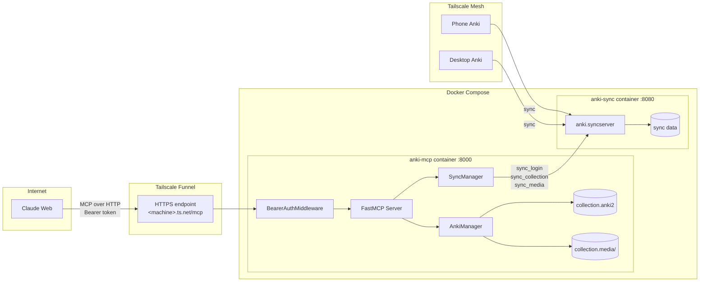
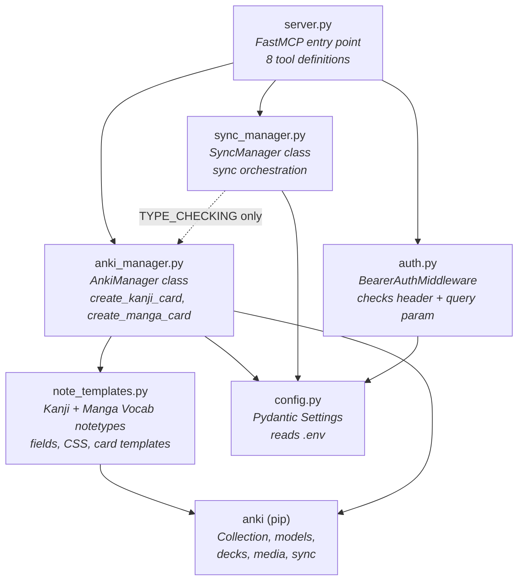
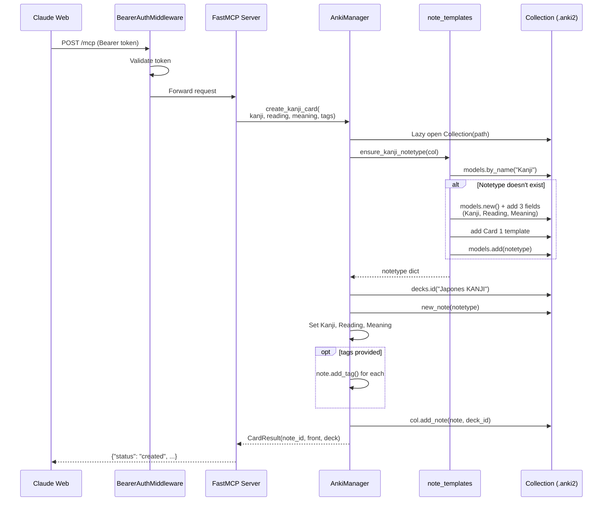
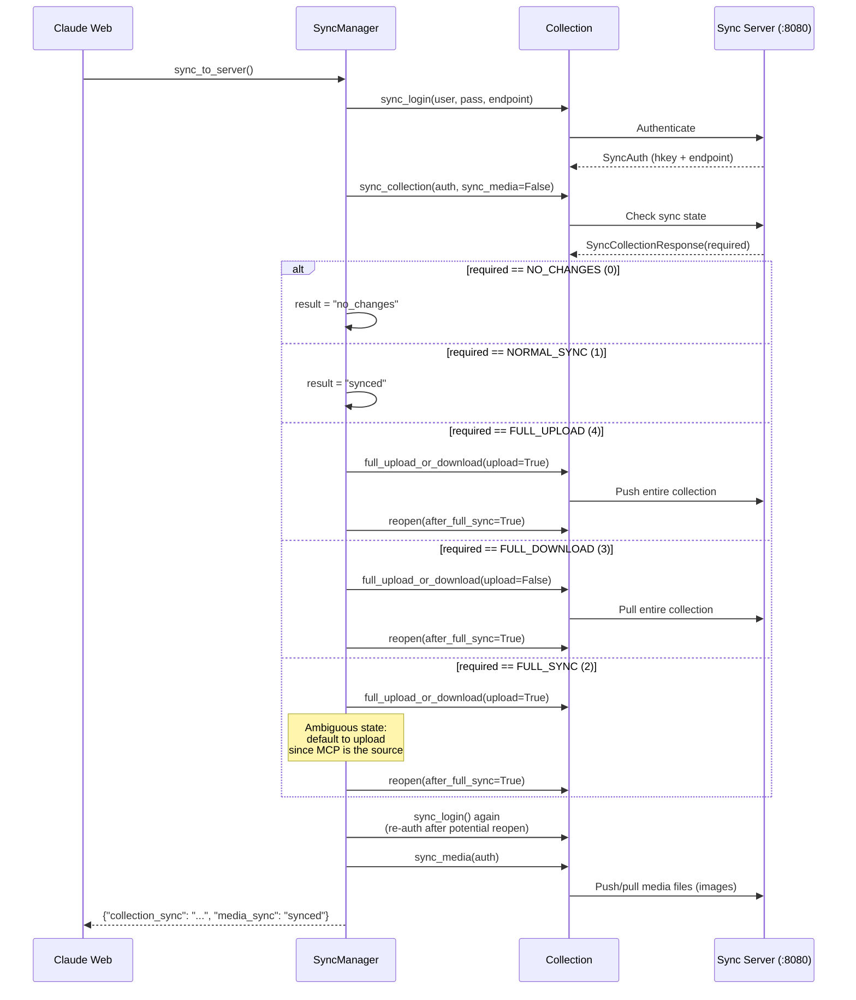
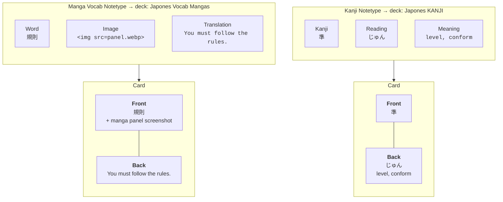
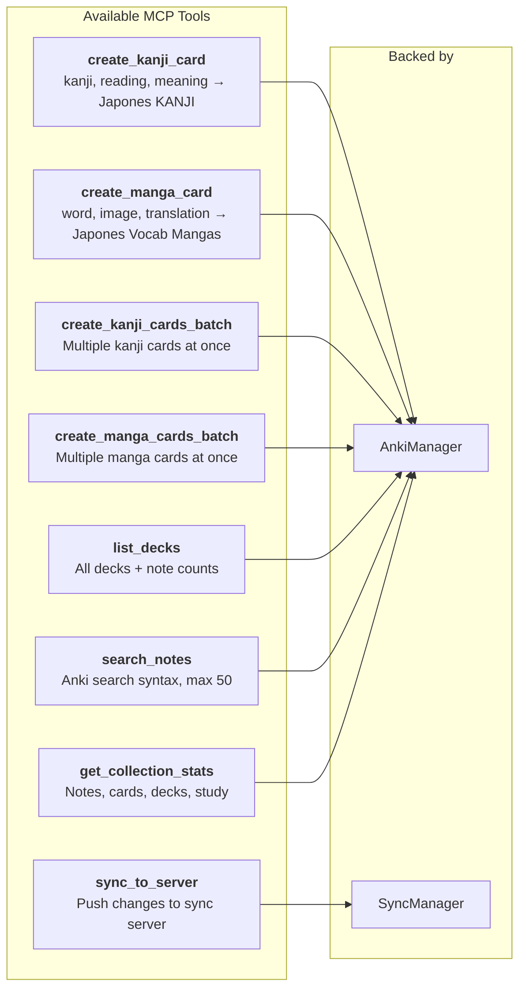

# Anki MCP

Headless Anki MCP server that runs in Docker, lets Claude Web create Japanese vocabulary flashcards (from manga panels), and syncs them to all devices via a self-hosted Anki sync server.

## Architecture

### Network Topology

How requests flow from Claude Web to your Anki devices:



### Module Dependency Graph

How the Python modules import each other:



### Card Creation Flows

#### Kanji card — `create_kanji_card`



#### Manga card — `create_manga_card`

```mermaid
sequenceDiagram
    participant C as Claude Web
    participant A as BearerAuthMiddleware
    participant M as FastMCP Server
    participant AM as AnkiManager
    participant NT as note_templates
    participant COL as Collection (.anki2)
    participant MEDIA as Media Folder

    C->>A: POST /mcp (Bearer token)
    A->>A: Validate token
    A->>M: Forward request

    M->>AM: create_manga_card(<br/>word, translation,<br/>image_base64, tags)

    AM->>COL: Lazy open Collection(path)
    AM->>NT: ensure_manga_notetype(col)
    NT->>COL: models.by_name("Manga Vocab")

    alt Notetype doesn't exist
        NT->>COL: models.new() + add 3 fields<br/>(Word, Image, Translation)
        NT->>COL: add Card 1 template
        NT->>COL: models.add(notetype)
    end

    NT-->>AM: notetype dict

    AM->>COL: decks.id("Japones Vocab Mangas")
    AM->>COL: new_note(notetype)
    AM->>AM: Set Word, Translation

    opt image_base64 provided
        AM->>AM: base64 decode → Pillow open
        AM->>AM: Convert RGB, resize max 1024px
        AM->>AM: Compress to WebP quality=80
        AM->>MEDIA: col.media.write_data(<br/>anki_mcp_{hash}.webp)
        AM->>AM: Image = &lt;img src="file.webp"&gt;
    end

    opt tags provided
        AM->>AM: note.add_tag() for each
    end

    AM->>COL: col.add_note(note, deck_id)
    AM-->>M: CardResult(note_id, front, deck)
    M-->>C: {"status": "created", ...}
```

### Sync Flow

What happens when Claude calls `sync_to_server`:



### Card Types

The two notetypes and the cards they produce:



### MCP Tools



## Setup

```bash
cp .env.example .env
# Edit .env with your values
docker compose up -d
```

### Tailscale Funnel

```bash
tailscale funnel --bg 8000
```

### Claude Web Connector

Settings > Connectors > Add custom connector:
- URL: `https://<machine>.ts.net/mcp`
- Auth: Bearer token from `.env`
