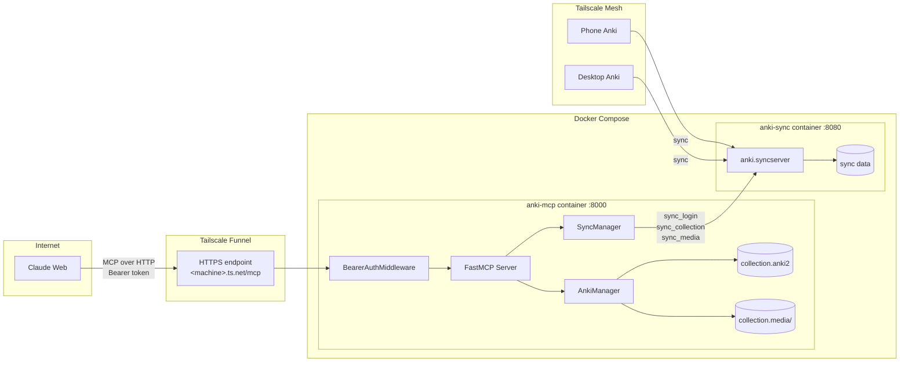
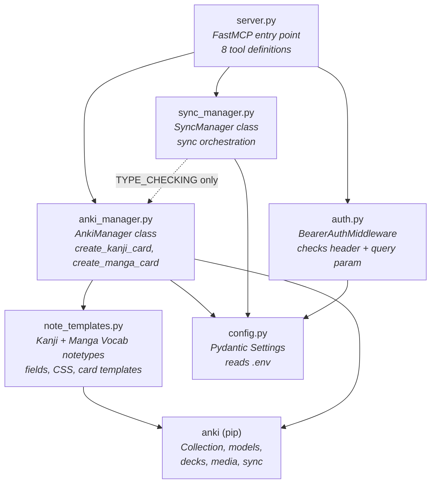
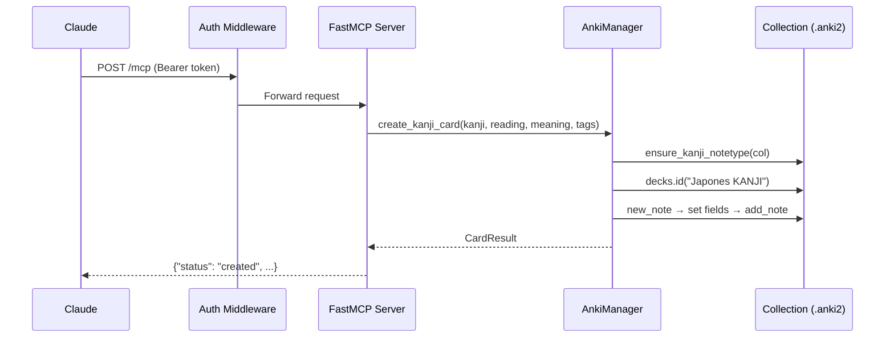
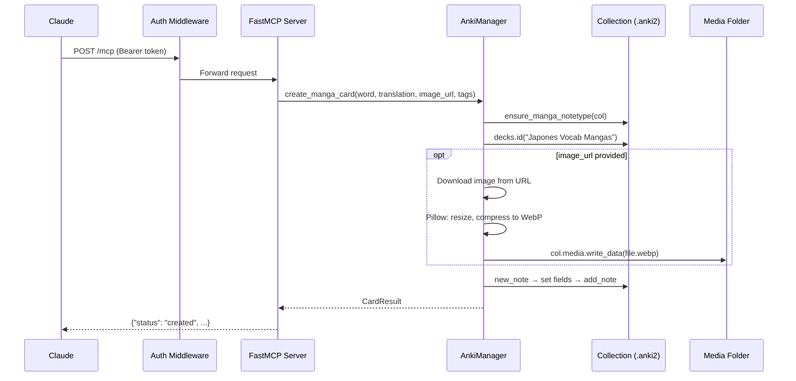
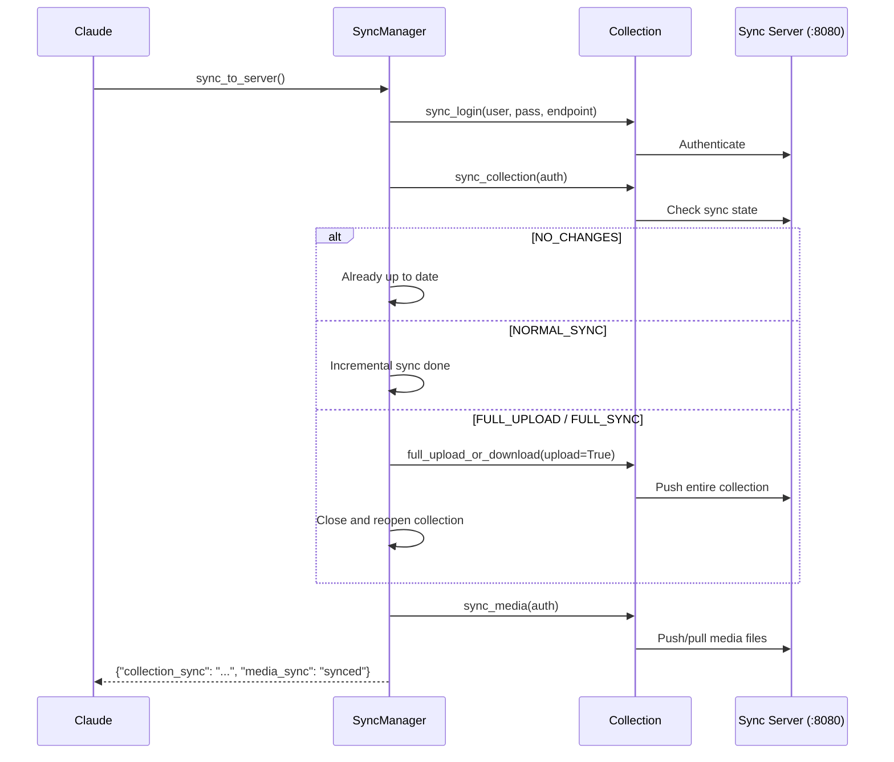
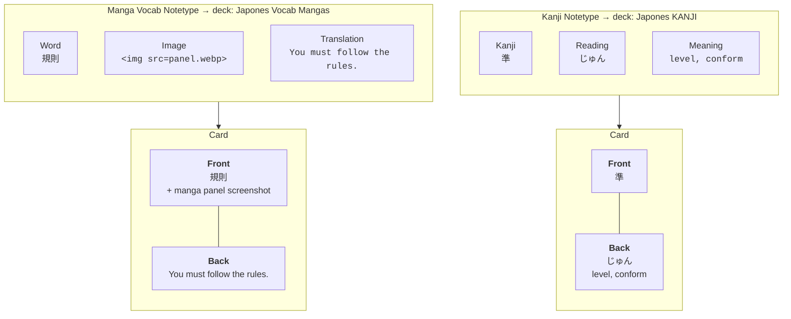
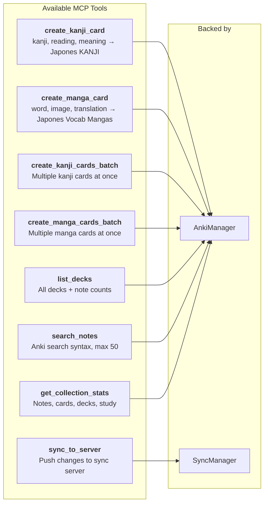

# Anki MCP

Headless Anki MCP server that runs in Docker, lets Claude create Japanese vocabulary flashcards (from manga panels), and syncs them to all devices via a self-hosted Anki sync server.

## Card Types

Two straightforward card types matching standard Anki study patterns:

**Kanji cards** (deck: `Japones KANJI`) — for kanji and vocabulary:
- Front: the kanji or word
- Back: reading (hiragana) + meaning

**Manga vocab cards** (deck: `Japones Vocab Mangas`) — for vocabulary from manga:
- Front: the Japanese word + a screenshot of the manga panel
- Back: translation of the full sentence from the panel

## Quick Start (Local with Claude Code)

### 1. Clone and configure

```bash
git clone https://github.com/ThiagoLira/anki-mcp-manga.git
cd anki-mcp-manga

cp .env.example .env
# Edit .env — at minimum set MCP_AUTH_TOKEN to something strong:
python3 -c "import secrets; print(secrets.token_urlsafe(32))"
```

### 2. Start the stack

```bash
# Docker
docker compose up --build -d

# Or Podman
podman compose up --build -d
```

This starts two containers:
- **anki-mcp** (:8000) — the MCP server
- **anki-sync** (:8080) — the Anki sync server

### 3. Connect Claude Code

Create `.mcp.json` in the project root (gitignored):

```json
{
  "mcpServers": {
    "anki": {
      "type": "http",
      "url": "http://localhost:8000/mcp",
      "headers": {
        "Authorization": "Bearer YOUR_TOKEN_HERE"
      }
    }
  }
}
```

Start a new Claude Code session in this directory. It will connect to the MCP server and have access to all the Anki tools.

### 4. Test it

Ask Claude Code to:
- `"list my anki decks"`
- `"create a kanji card for 食べる (たべる, to eat)"`
- `"sync to server"`

## Expose to Claude Web (Tailscale Funnel)

To use this from Claude Web (claude.ai), you need to expose the MCP server over HTTPS. Tailscale Funnel does this with automatic TLS certificates.

### 1. Install Tailscale

See [tailscale.com/download](https://tailscale.com/download).

### 2. Enable Funnel

```bash
sudo tailscale funnel 8000
```

This maps `https://<machine>.<tailnet>.ts.net/` to `localhost:8000`.

### 3. Add connector in Claude Web

Go to [claude.ai/settings/integrations](https://claude.ai/settings/integrations):
1. Click **Add more integrations** → **Custom integration**
2. **Name**: `Anki`
3. **URL**: `https://<machine>.<tailnet>.ts.net/mcp`
4. **Authentication**: Bearer Token → paste your `MCP_AUTH_TOKEN`

Claude Web can now create flashcards directly in conversation.

### 4. Point Anki clients at the sync server

On your phone/desktop Anki (must be on the same Tailscale network):
- **Preferences → Syncing → Self-hosted sync server**
- URL: `http://<machine>.<tailnet>.ts.net:8080` or `http://100.x.x.x:8080`
- Username/password: from your `.env` (`SYNC_USER` / `SYNC_PASSWORD`)

## Data Management

### Where data lives

```
data/
├── mcp/                    ← MCP server's Anki collection
│   ├── collection.anki2
│   └── collection.media/   ← images (manga panels, etc.)
└── sync/                   ← Sync server's data
    └── user/
```

The `data/` directory is gitignored. This is the only state you need to back up.

### Import your existing Anki collection

If you already have an Anki collection you want to use:

```bash
# Stop the MCP container first
docker compose stop anki-mcp

# Copy your collection
cp ~/.local/share/Anki2/User\ 1/collection.anki2 data/mcp/
cp -a ~/.local/share/Anki2/User\ 1/collection.media/. data/mcp/collection.media/

# Restart
docker compose start anki-mcp
```

Then call `sync_to_server` from Claude to push it to the sync server.

### Sync workflow

```
Claude creates card → MCP server adds to local collection
                    → call sync_to_server
                    → pushes to self-hosted sync server
                    → phone/desktop Anki syncs from same server
```

After creating cards, always call `sync_to_server` to push changes. When Anki desktop syncs, if there's a conflict, choose **"Download from server"** to get the MCP's cards.

### Backup

Just back up the `data/` directory. Or rely on the sync server — any Anki client pointed at it has a full copy.

### Migration back to AnkiWeb

1. Open Anki desktop
2. Remove the custom sync server URL from preferences
3. Sync to AnkiWeb — choose **"Upload to AnkiWeb"**

## Architecture

### Network Topology



### Module Dependency Graph



### Card Creation Flow (Kanji)



### Card Creation Flow (Manga)



### Sync Flow



### Card Types



### MCP Tools



## Environment Variables

| Variable | Description | Default |
|---|---|---|
| `MCP_AUTH_TOKEN` | Bearer token for MCP auth (required) | — |
| `SYNC_USER` | Sync server username | `user` |
| `SYNC_PASSWORD` | Sync server password | `password` |
| `SYNC_ENDPOINT` | Sync server URL (internal) | `http://anki-sync:8080` |
| `COLLECTION_PATH` | Path to collection inside container | `/data/collection.anki2` |
| `KANJI_DECK` | Target deck for kanji cards | `Japones KANJI` |
| `MANGA_DECK` | Target deck for manga cards | `Japones Vocab Mangas` |
| `SYNC_USER1` | Sync server credentials (`user:pass`) | `user:password` |

## Development

```bash
# Create venv with Python 3.11 (required by anki package)
uv venv --python 3.11 .venv
source .venv/bin/activate
uv pip install -e ".[dev]"

# Run tests
MCP_AUTH_TOKEN=test pytest tests/ -v

# Run server locally (without Docker)
MCP_AUTH_TOKEN=test python -m src.server
```
